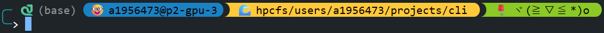

# 1.  Open an interactive shell in A100's node

Send a request to open `bash` shell in a A100's node using this command:

```bash
srun \
    --partition=a100 \
    --nodes=1 \
    --ntasks=1 \
    --mem=8G \
    --gpus-per-node=1 \
    --time=01:00:00 \
    --mail-type=ALL \
    --mail-user=namkha.nguyen@adelaide.edu.au \
    --pty bash
```

When a node is allocated successfully, you will see your terminal connects directly to the A100's node like this:



In the example above, I have connected successfully to the `p2-gpu-3` node

From now on you can run your task directly using command like `python /absolute/path/to/script/main.py` without having to send job scripts using `sbatch` anymore.

# 2. Run debugging mode in HPC's node

I usually run code in debug mode, using features like setting breakpoints, executing code line by line, and inspecting variables at each stage of the program. This mode is extremely useful for identifying bugs and ensuring that the program behaves as intended.

To run Python script in VSCode's debug mode, run this command in the terminal of A100's node connected in step 1 above:
```bash
python -m debugpy --listen 0.0.0.0:5678 --wait-for-client /absolute/path/to/script/main.py
```  