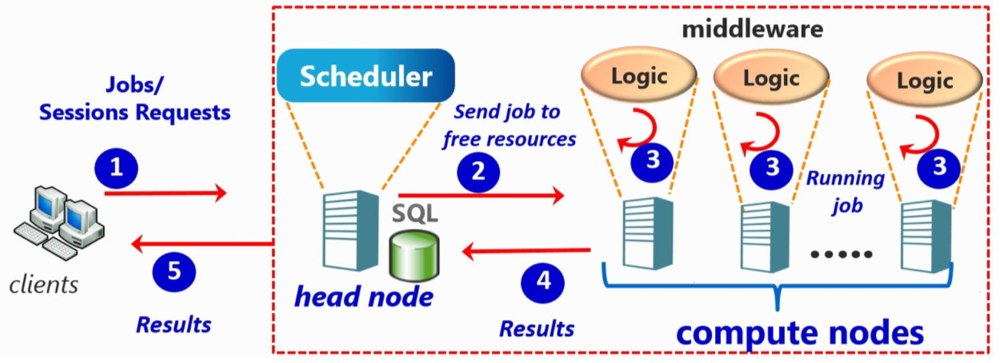
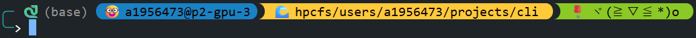
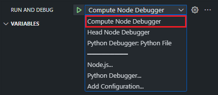

# 1. Open an Interactive bash Shell on a Compute Node

To request an interactive `bash` shell on a compute node, run the following command in your head node:

```bash
srun \
    --partition=a100 \
    --nodes=1 \
    --ntasks=1 \
    --mem=8G \
    --gpus-per-node=1 \
    --mail-type=BEGIN \
    --mail-user=namkha.nguyen@adelaide.edu.au \
    --pty bash \
    --time=01:00:00
```

Keep the argument `--pty bash` unchanged - it ensures that you start an interactive bash session.
You can adjust the other arguments (e.g., memory, GPUs, time limit, etc.) based on your specific requirements.

Once the node is successfully allocated, your terminal will connect directly to the compute node, like this:



In the example above, I have connected successfully to the compute node `p2-gpu-3`.

From this point, you can run your tasks directly, for example: `python /absolute/path/to/script/main.py` without having to send job scripts via `sbatch` anymore.

<div role="alert" aria-label="Warning" style="border:2px solid #d9363e; background-color:#ffccc7; padding:12px; border-radius:6px; color:#000000; padding-bottom:0">
  <p><strong>⚠️ Warning:</strong> This method fully occupies the GPU for your personal use to enable fast and uninterrupted testing. As a result, there may be periods when the GPU remains idle and underutilized, which leads to resource waste.

Therefore, to ensure fair and efficient use of resources, try to maximize GPU usage during your allocation period. If you are AFK or no longer actively testing, please release the compute node so that others can access the GPU.</p></div>


# 2. Run debug mode in HPC's node

In this section I will show how to run program in VSCode's debug mode on a compute node (I'm not sure if it works for other IDE/text editor).

## 2.1. Install `debugpy`

First install `debugpy`

```pip
pip install debugpy
```
## 2.2. Start the Debug Server on the **compute node**
Run this command in the terminal of the **compute node** we connected to in Section 1 (`p2-gpu-3` in this example):

```bash
python -m debugpy --listen 0.0.0.0:5678 --wait-for-client /absolute/path/to/script/main.py
```
This command starts a debug server in **compute node** `p2-gpu-3` and waits for a connection from your **head node** `p2-log-1`.
(You can change the port 5678 if needed.)

## 2.3. Configure VSCode's debugging mode on the **head node**

On your **head node**, create a file named `.vscode/launch.json` in your workspace and add the following configuration:
```json
{
    "version": "0.2.0",
    "configurations": [
        {
            "name": "Compute Node Debugger",
            "type": "debugpy",
            "request": "attach",
            "connect": {
                "host": "p2-gpu-3.hpc.adelaide.edu.au",
                "port": 5678
            },
            "justMyCode": false
        },
        {
            "name": "Head Node Debugger",
            "type": "debugpy",
            "request": "launch",
            "program": "${file}",
            "console": "integratedTerminal",
            "args": "",
            "justMyCode": false
        }
    ]
}
```
This `configuration` array has two debugging setups:
- **Compute Node Debugger** - attaches VSCode to the running debug server on the **compute node**.
- **Head Node Debugger** - (optional) runs code directly on the **head node** for local debugging.

You can remove the second configuration if you don't need to debug on the head node.

In the first configuration, ensure that the `host` matches the **compute node** you connected to in Section 1, and that the `port` matches the one you specified when starting `debugpy`.

In my example, `host` and `port` should be:
- `host`: `p2-gpu-3.hpc.adelaide.edu.au`
- `port`: `5678`

## 2.4. Start debugging

Open the Python script you want to debug in VSCode. Then, open the **Run and Debug** panel (`Ctrl + Shift + D`). Ensure that the selected debugger configuration is `Compute Node Debugger`, like this:



Then hit `F5` to start debugging, VSCode will attach to the **compute node**'s debug server, and your session will begin.
